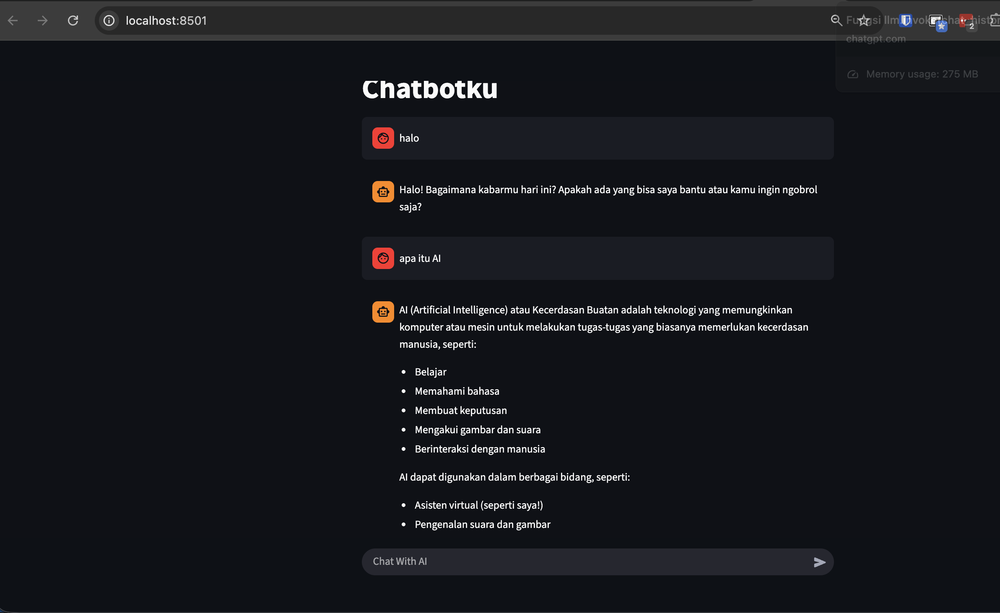

# Streamlit
- cara running file python
```
cd 5. Streamlit
python app1.py
```

- cara running streamlit
```
streamlit run app1.py
```

- cara cek conda apakah terinstall
```
conda --version
```

- jalankan env
```
conda create --name avpn-project python=3.13
conda activate avpn-project
```

- install semua package
```
pip install -r requirements.txt
```



